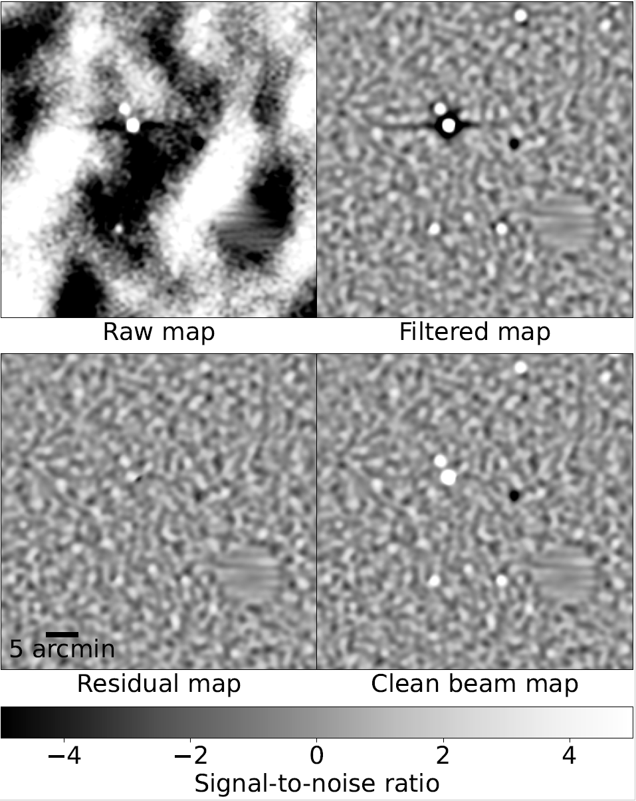
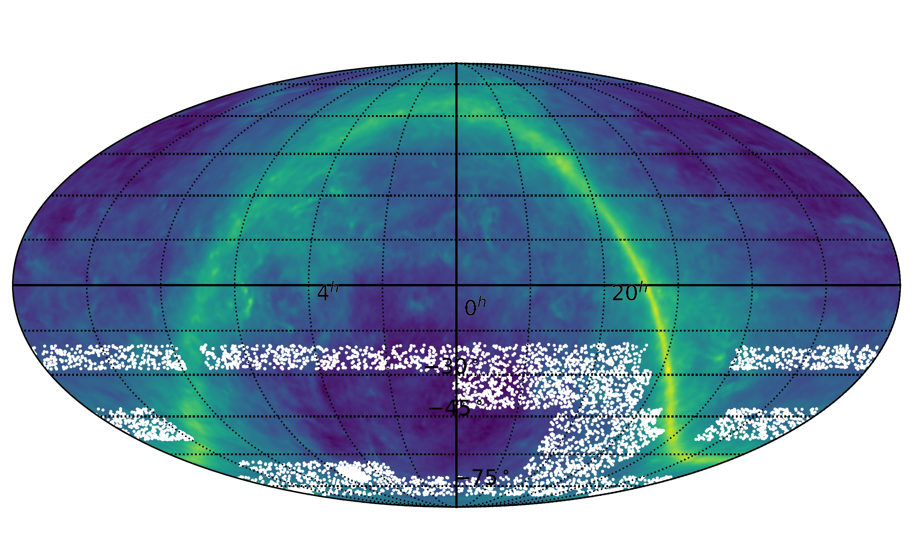
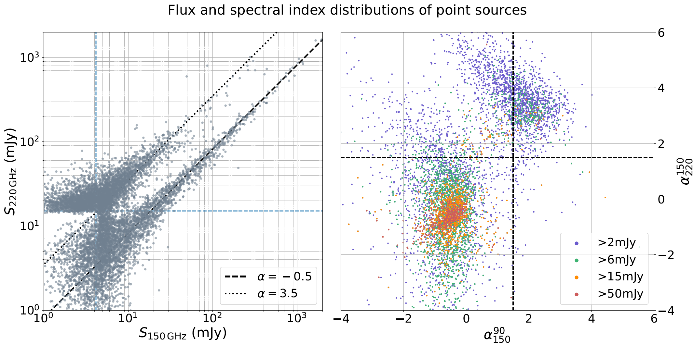

# The-SPT-3G-Wide-Survey-Preliminary-Point-Source-Catalog

The South Pole Telescope (SPT) is a 10-meter diameter gregorian telescope with cryogenic millimeter-wavelength receivers. This page summarizes work I did for point sources using data taken by the SPT-3G receiver.

The SPT-3G Wide survey is a 6,000 square-degree extension of the SPT-3G Main and Summer surveys in the Southern hemisphere. The observation campaign ran for most of the 2024 observing season, with the residual observing time dedicated to the Euclid Deep Field-South field (a paper I co-authored [here](https://arxiv.org/abs/2506.00298)). I analyzed the SPT-3G Wide survey to detect astronomical point sources for use in masking and source subtraction for galaxy cluster detection (see my other project here) as well as lensing analyses of the CMB.

The survey is broken up into nine fields with the alphabet labels shown below.

  
   
  <em>The SPT-3G Wide survey covers ~6,000 square-degrees of the Southern hemisphere and was observed by the SPT in the 2024 observing season. The survey is broken up into nine individual fields with corresponding alphabet labels. Figure from Hryciuk 2025.</em>

## Problem Statement:
Point sources are astronomical objects (active galactic nuclei, radio galaxies, dusty-star forming galaxies, etc) that are physically smaller than the beam-width of the telescope, but nonetheless appear in sky maps with the shape of the beam. The amplitude of the point sources are driven by their corresponding flux in the millimeter-wave band (SPT-3G band centers are at 95, 150, and 220 GHz). Further, the data processing of SPT's mapmaking algorithm aggressively filters the timestream data to remove atmospheric contamination, this causes spurious "wings" to appear along the telescope's scan direction that are not physical and cause many headaches in galaxy cluster and CMB analyses. An example of this in real data can be seen below in the top-left panel of the four-panel figure.

## Data Analysis (Detection):
In order to detect these sources, whether for study or for mitigation, I had to construct a filter optimized to spatially-select beam-like objects and is processed in the same manner as the timestream data. To construct this filter, I use the individual coadded (season-averaged) sky maps for each of the three frequency bands and each of the nine SPT-3G Wide survey fields. There are a myriad of signals present in each of these sky maps that are rejected based on a foreground model, forming an angular-scale dependent weighting along with the filtering used in data processing and the telescope beam. A visual representation of the result is shown below.

[optimal filter]

Once the filter is constructed, the spurious "wings" from the timestream filtering need to be taken care of, which is done iteratively using an adapted version of the CLEAN algorithm (citation). The CLEAN algorithm generates a template point source from the beam convolved with the timestream filtering. The template is rotated by a sky-coordinate-dependent angle calculated with information on the particular projection (Lambert-ZEA in this case). An amplitude-scaled and rotated template is then iteratively subtracted from the maximum pixel value in the optimally filtered sky map. 

The entire point source detection process is shown in steps below.

  
   
  <em>Each panel is an important step in the point source finding procedure. The top left is the raw coadded (season-averaged) sky map data with the point sources intact. The raw maps are optimally filtered to preferrentially select telescope beam-like spatial profiles to produce the top right panel. The CLEAN algorithm removes the point sources and spurious "wings" caused by timestream filtering (bottom left). The raw sky maps are cleaned by re-injecting the correct point source profiles back into the map with the correct flux. Figure from Archipley et al. 2025.</em>

## Summary of Catalog Results:

With the above analysis and the point sources preferrentially selected from optimally filtered sky maps, I can start to build an understanding of the astronomical populations that are present in the catalogs. I detected 26,373 objects across all three SPT-3G frequency bands in 5,971 square-degrees of data. 

  
   
  <em>I detected 26,373 point source objects using three frequency bands (90, 150, and 220 GHz) and all nine of the SPT-3G Wide survey fields. Above is the spatial distribution of these sources on the sky (filtered for clarity). Figure from Hryciuk 2025.</em>

I generated a masking list to be used by in galaxy cluster and lensing analyses. This punches holes in the sky map where unwanted signal should be removed. I threshold the catalog by flux and frequency and calculate the mask radius by the intersection of the amplitude of the telescope beam with the noise floor (1-sigma). The result is a masking list of the form (R.A. and Dec are the sky coordinates Right Ascension and Declination)

|SPT IAU Name|R.A. (deg)|Dec (deg)|Masking Radius (arcmin)|Flux (mJy)|
|:----:|:----:|:----:|:----:|:----:|
|SPT-S J045702-2324.7|74.261|-23.412|4.5|1010|
|SPT-S J012031-2700.8|20.13|-27.013|2.7|220|
|SPT-S J045700-2324.7|74.254|-23.413|4.1|733|
|SPT-S J045705-2324.3|74.274|-23.406|3.3|431|
|SPT-S J035212-2513.9|58.051|-25.233|2.1|62.8|

I also analyzed the different point source populations from the total catalog, for which two are noticeable: radio galaxies and dusty galaxies. Radio galaxy emission is characterized by a flux that falls with frequency while dusty galaxy emission rises (thermal spectrum). The three individual frequency catalogs are combined and their spectral indices ($\alpha$) calculated by the ratio of the logs of fluxes and the frequencies. Radio galaxies will group along a spectral line of $\alpha=-0.5$ while thermal emission groups along the line $\alpha=3.5$. The two are present in the figure below.

  
   
  <em>I detected two distinct populations of astronomical sources characterized by the source's spectral index: radio galaxies and dusty-star forming galaxies. Radio galaxy emission is dominated by a spectrum that falls with frequency. These sources group along the alpha=-0.5 spectral index line in the left panel and scattered around the bottom left quandrant of the right panel. Dusty galaxy emission follows a thermal spectrum which rises with frequency. These sources group along the alpha=3.5 line in the left panel and scattered about the top right quadrant of the right panel. Figure from Hryciuk 2025.</em>

I use these catalogs to create a sense of probability distribution for the two populations in the number and flux parameter space. These probability distribution curves are widely used to model point sources in simulated data that is critical to calibrating analyses and better understanding aggregate noise properties. It is very important to get this right, and I compare the curves I calculated for the SPT-3G Wide survey with previously published populations from Everett et al. 2020.

  
   
  <em>I used the two populations plotted above to generate probability distribution curves in number and flux space. These probability distribution are used to accurately simulate data that is critical to calibrating analyses as well as to understand aggregate noise properties of the survey. I compare my curves to distributions previously published in Everett et al. 2020. Figure from Hryciuk 2025.</em>

## Files:
- Summary plots: /summary_plots/

## Bilbiography:
- Hryciuk, Alexander. 2025. “The SPT-3G Wide Survey Galaxy Cluster Catalog and the SPT-3G+ Cryostat Design.” University of Chicago. https://doi.org/10.6082/UCHICAGO.15844.
- Archipley, M., Hryciuk, A., Bleem, L. E., et al. 2025, Millimeter-wave observations of Euclid Deep Field South using the South Pole Telescope: A data release of temperature maps and catalogs. https://arxiv.org/abs/2506.00298
- Everett, W. B., Zhang, L., Crawford, T. M., et al. 2020, The Astrophysical Journal, 900, 55, doi: 10.3847/1538-4357/ab9df7

